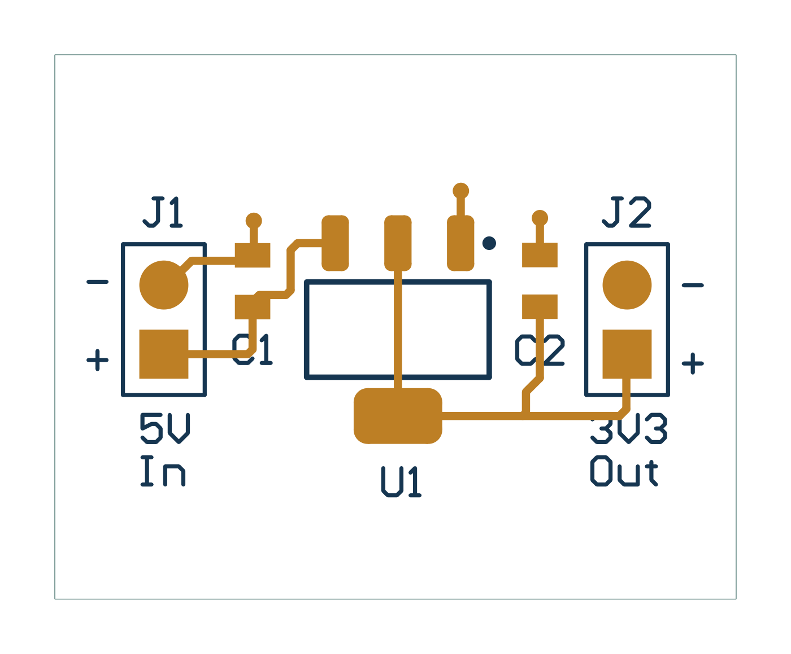

# 5V to 3.3V LDO

A 5V-to-3.3V regulator design with schematic, PCB, local libraries, BOM, and Gerber exports.

*Preview generated from the supplied Gerber layers.*

## Files

- [Complete project archive](Archives/5V_to_3V3_LDO.zip)
- [Saved design-rule report](Reports/5V_to_3V3_LDO-DRC.txt)
- Editable source files are also available in the project source folder.

## Design status

The saved DRC report records **0 violations and 0 waived violations**. This is an existing report, not a fresh check of the source.

## Use and validation

Open editable project files in their original CAD application. The archives preserve project subfolders; extract an archive before opening its project. External libraries or 3D-model paths may need to be remapped on another computer.

These are portfolio design files. Existing reports are snapshots from their recorded dates; fabrication exports are not evidence of manufactured or bench-tested hardware. Review the design and rerun the checks before fabrication.

No blanket license is assigned. Third-party components, libraries, and tutorial material retain their original rights and terms.

## Browse this project

Open [5V_to_3V3_LDO.PrjPcb](Altium_Project/5V_to_3V3_LDO.PrjPcb) in Altium Designer. Download or clone the whole repository to keep related files together.

| Folder | Contents |
| :--- | :--- |
| [Altium_Project/](Altium_Project/) | Editable project, schematic, PCB and supporting native libraries/BOM documents kept together for relative references |
| [Archives/](Archives/) | Unchanged original complete project ZIP |
| [BOM/](BOM/) | Supplied bill of materials exports |
| [Documentation/](Documentation/) | Supporting documentation and preserved source-reference snapshots |
| [Images/](Images/) | Existing schematic and board previews |
| [Manufacturing/](Manufacturing/) | Existing fabrication, drill and assembly outputs |
| [Reports/](Reports/) | Saved design-check reports |

Native libraries and `.BomDoc` files stay next to the `.PrjPcb` to retain source references. Existing output `DocumentPath` entries are adjusted to the grouped folders where those files were supplied. Original project files and archives are retained. Some pre-existing HTML check-report references and absolute output-job/model paths have no portable supplied equivalent; regenerate/remap these in Altium if needed. No new design-rule check was run during this reorganization.
