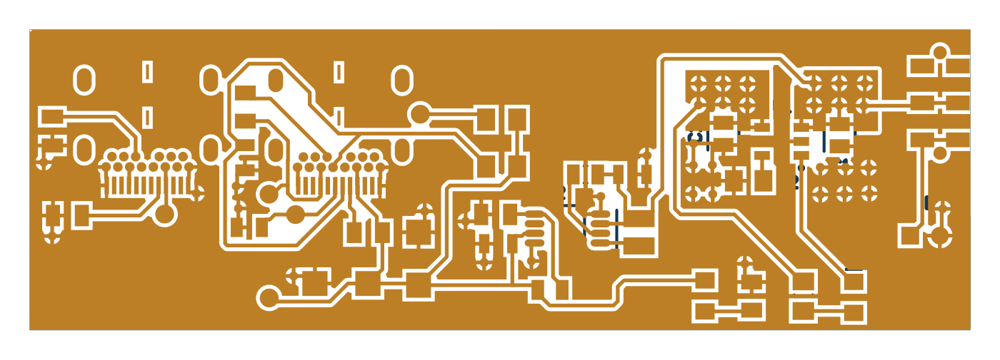

# Altium PCB Design Portfolio

**Schematics · PCB layout · Manufacturing documentation**

A collection of four Altium design projects, from LED indicators to voltage regulation and USB-C power circuitry.

*USB-C board preview generated from supplied Gerber layers.*

## Projects

| Project | Scope | Saved DRC violations |
| :--- | :--- | :---: |
| [5V LED Indicator](5V_LED_Indicator/README.md) | A basic 5V LED indicator schematic and PCB layout. | 4 |
| [5V to 3.3V LDO](5V_to_3V3_LDO/README.md) | A 5V-to-3.3V regulator design with schematic, PCB, local libraries, BOM, and Gerber exports. | 0 |
| [Tutorial LED Board](LED_Youtube/README.md) | A tutorial-based LED board with two indicator branches, assembly drawings, schematic PDF, BOM, STEP model, Gerbers, drill files, and pick-and-place data. | 0 |
| [USB-C Charger and Boost Converter](USBC_Charger/README.md) | A two-sheet design covering charge control and a step-up DC/DC converter, with PCB, custom libraries, and fabrication exports. | 0 |

## Browse and download

Open a project guide above for its files and design status. Editable source and native libraries are grouped under each project’s Altium_Project/. Existing exported files are grouped under BOM/, Manufacturing/, Reports/ and Models/ where supplied. Original complete ZIPs remain under Archives/.

## Use and validation

Open editable project files in their original CAD application. The archives preserve project subfolders; extract an archive before opening its project. External libraries or 3D-model paths may need to be remapped on another computer.

These are portfolio design files. Existing reports are snapshots from their recorded dates; fabrication exports are not evidence of manufactured or bench-tested hardware. Review the design and rerun the checks before fabrication.

No blanket license is assigned. Third-party components, libraries, and tutorial material retain their original rights and terms.

## Repository organization

Each project guide links to its editable sources, available outputs and recorded status. Original project archives remain unchanged. [Reorganization record](Documentation/REORGANIZATION.md) documents preservation and path changes.

## Related portfolios

- [KiCad PCB projects](https://github.com/ehasunchy/kicad-pcb-projects)
- [Altium PCB projects](https://github.com/ehasunchy/altium-pcb-projects)
- [AutoCAD WTP control panel](https://github.com/ehasunchy/autocad-wtp-control-panel)
